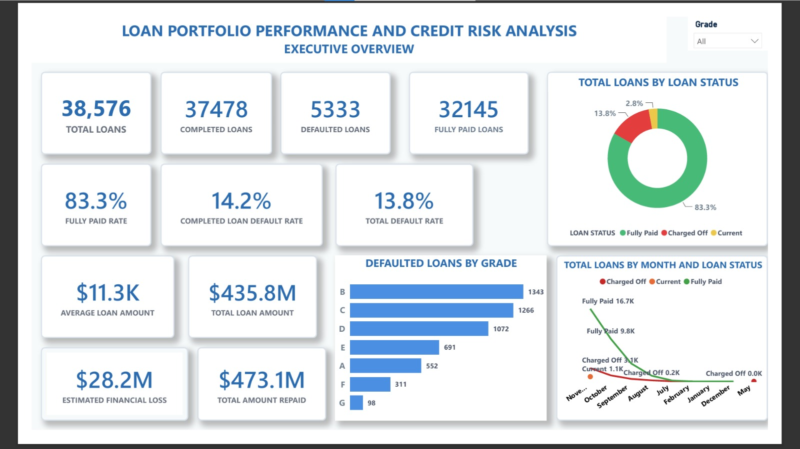
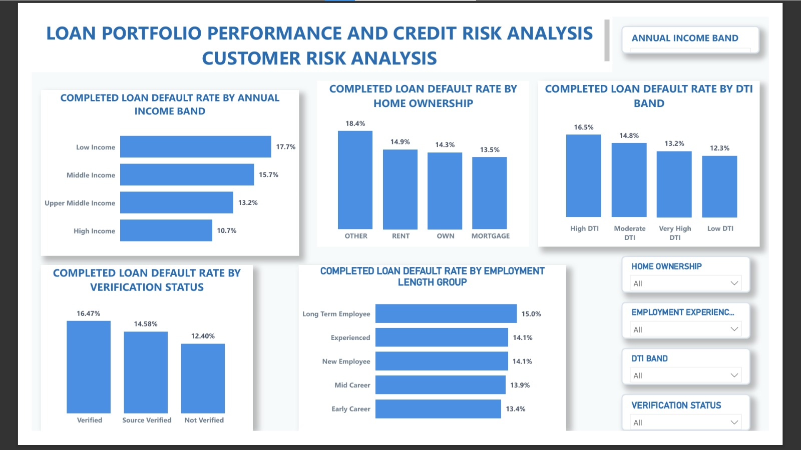
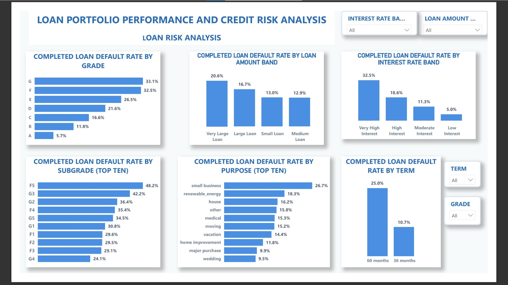

# Bank-Portfolio-Performance-and-Credit-Risk-Analysis
An independent data analytics project exploring bank portfolio performance and credit risk using historical loan data
## Project Overview
This project analyses bank portfolio performance and credit risk using historical loan dataset obtained from Kaggle.
The analysis explores loan performance, borrower characteristics, and factors associated with higher loan default risk.
The goal is to transform loan data into meaningful insights that can support better lending decisions, portfolio monitoring, and credit risk assessment.
> **Disclaimer:** This is an independent educational project and is not affiliated with or endorsed by HSBC Bank.

## Dataset
The dataset used for this project is a historical loan dataset relating to HSBC Bank, obtained from Kaggle and published by Tushar Nandanwar.
It contains loan records across the 50 states of the United States and includes information relating to borrowers, loan characteristics, loan status, interest rates, credit grades, debt-to-income ratios, loan purposes and other relevant variables.
The original dataset of 38,576 records and 24 variables was cleaned and transformed using power query before being used for analysis.

## Tools Used
- Microsoft Excel
- Power Query
- SQL
- Power BI
- DAX

  ## Project Objectives
  The analysis was conducted to:
  - Evaluate the overall performance of the loan portfolio.
  - Identify customers characteristics associated with higher completed loan default rates.
  - Identify loan characteristics associated with increased default risk.
  - Evaluate the effectiveness of income verification in reducing loan default.
  - Develop a profile of a high-risk borrower.
 
    ## Power BI Dashboard
    The dashboard presents the analysis across the six objectives:
 
    ### 1. Executive Overview
    
 
    ### 2. Customer Risk Analysis
    
 
    ### 3. Loan Risk Analysis
    
 
    ### 4. Geographic Credit Analysis
    
 
    ### 5. Income Verification and High Risk Profile
    
    
    ## Key Insights
    The analysis identified several characteristics associated with a higher likelihood of loan default including:
    - Low-income borrowers.
    - High debt-to-income (DTI) ratios.
    - Very large loans.
    - Low credit grades particularly Grades G,F,E.
    - Higher interest rates.
    - 60-month repayment terms.
    - loan requested for small business purposes.
    - Geographic regions with relatively higher completed loan default rates.
    These characteristics should not automatically result in loan rejection but can serve as indicator for enhanced credit assessment and additional risk evaluation.

## Recommendations
Based on the analysis and its findings, the following recommendations were made:
- **Strengthen credit assessment for high-risk borrower groups:** Implement more robust credit assessment and additional risk evaluation for borrowers with characteristics associated with higher default tendencies, such as low income, high debt-to-income (DTI) ratios, very large loans, and lower credit grades.
- **Monitor high-risk loan products and lending patterns more closely:** Increase scrutiny and monitoring of loan segments associated with higher default tendencies, including higher-interest loans, lower credit grades, and loans taken for higher-risk purposes such as Small Business.
- **Encourage appropriate repayment terms where feasible:** Review repayment structures carefully, particularly for loans with longer terms, and encourage repayment arrangements that better align with borrowers' financial capacity.
- **Improve geographic credit risk monitoring:** Pay closer attention to geographic regions with relatively higher completed loan default rates to support more proactive credit risk management.
- **Continue strengthening affordability and repayment capacity assessments:** Give greater consideration to borrower income levels, debt-to-income ratios, and overall long-term repayment capacity during credit assessment.
- **Implement continuous portfolio monitoring using business intelligence dashboards:** Use dashboards to continuously track loan performance, emerging lending patterns, geographic risk, and changes in portfolio credit risk.

## Repository Contents
This repository contains:
**Dataset** - Cleaned and transformed data used for the analysis.
**SQL** - SQL queries used during the project.
**Power BI** - Power BI dashboard and analysis files.
**Presentation** - Capstone Project presentation.
**Images** - Dashboard screenshots and project visuals.
**Report** - Project Report for more detailed access to full methodology, analysis, findings and recommendations.

## Author
**Grace Olunumelu**

---
*This project was completed as part of the Techcrush Data Analytics Scholarship Programme.*
